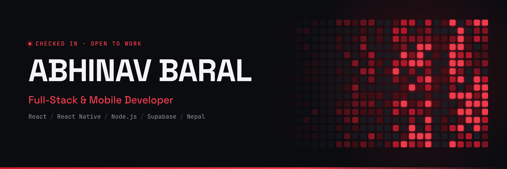

 

&nbsp;

&nbsp;

---

## Snapshot

| **In Production** | **Full-Stack & Mobile** | **Final-Year BCA** | **Open to Work** |
|:---:|:---:|:---:|:---:|
| Payroll system in daily use | React · React Native · Node.js | Model Campus Damak · TU | Junior roles · Freelance |

I build full-stack web and mobile apps that run real operations. Most of my focus is the backend: business rules, data modelling, and the parts where one wrong number costs someone money.

---

## Tech Stack

**Languages** &nbsp; `JavaScript` · `SQL`

**Frontend** &nbsp; `React` · `Vite` · `Next.js` · `Tailwind CSS`

**Mobile** &nbsp; `React Native` · `Expo` · `React Navigation` · `EAS Build` · `expo-updates (OTA)`

**Backend** &nbsp; `Node.js` · `Express` · `REST APIs` · `Cron jobs` · `WhatsApp Cloud API`

**Data** &nbsp; `PostgreSQL (Supabase)` · `Firebase Auth` · `Firestore`

**Tooling** &nbsp; `Git` · `Postman` · `Render` · `Linux`

---

## Projects

### HR, Attendance & Payroll System

> *Built for a private company in Nepal and used by its staff every day. The source and client are confidential, so this is an overview only.*

**Problem:** Attendance and salary were calculated by hand, with rules for late check-ins, lunch overruns, half-days, overtime and field work. Mistakes were constant and disputes were hard to settle.
**Solution:** An employee mobile app for check-in and check-out plus viewing their own pay, a web admin dashboard, and a REST API. All three share one payroll engine and a dual Nepali **BS / AD** calendar.
**Stack:** React Native (Expo) · React · Node.js / Express · PostgreSQL (Supabase)
**Role:** Sole developer (design, backend, mobile, web, deployment)

**Engineering highlights**
- **One source of truth for money.** Found and removed a duplicate salary calculation that made employee and admin screens disagree; every pay view now goes through a single engine.
- **Rule-based time engine.** Grace windows, rounding rules, half-day detection and role-restricted overtime, migrated without losing historical payroll records.
- **Notification pipeline.** WhatsApp Cloud API with a cron-driven outbox queue and duplicate-send protection.
- **Payslips** printable per employee or for the whole team over any date range.

---

### abhinavbaral.com.np — Portfolio

> *React (Vite) + Express. Organised around four disciplines: Frontend, Backend, Mobile, Words.*

- Two-axis theme system (light/dark × crimson/lime accent)
- WCAG AA contrast verified in every theme
- Honest proficiency levels instead of fake percentage bars

<!-- TODO: add repo badge if the portfolio repo is public -->

---

## Currently

- 🔨 Building a media-tracking app (anime, manga, film) with an Express backend and a hand-written recommendation algorithm
- 📚 Learning system design, database optimisation and DevOps fundamentals
- 💼 Taking freelance web, mobile and technical-writing work

---

## GitHub Activity

---

*Open to junior developer roles and freelance projects · Jhapa, Nepal · Remote-friendly*

